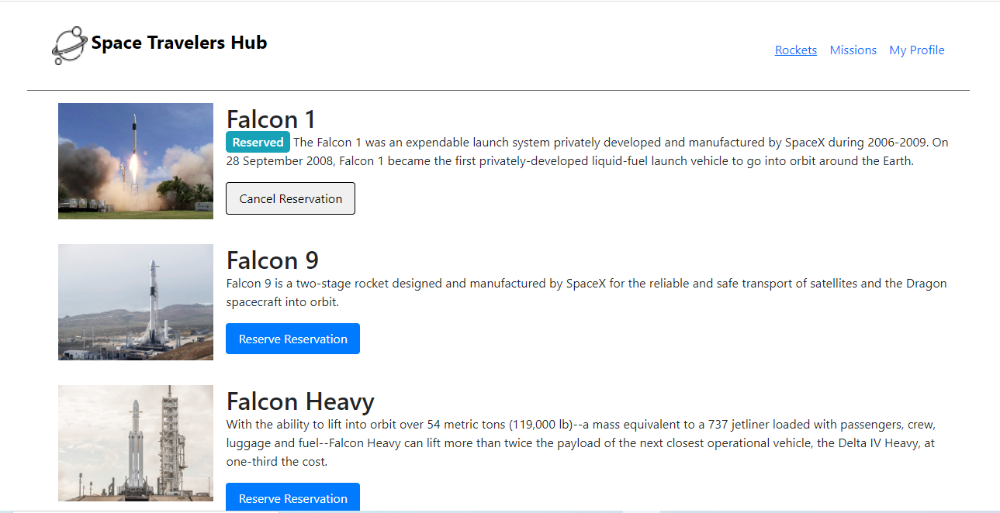
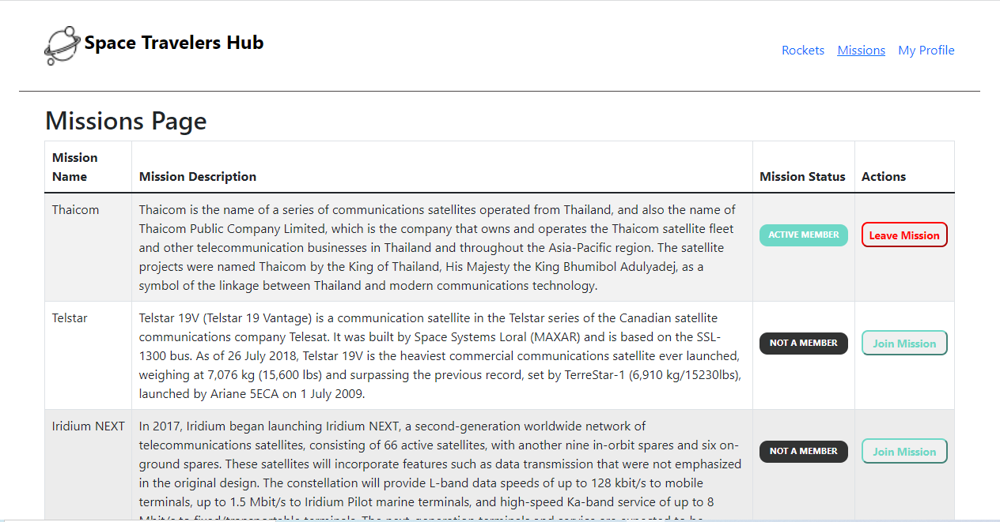
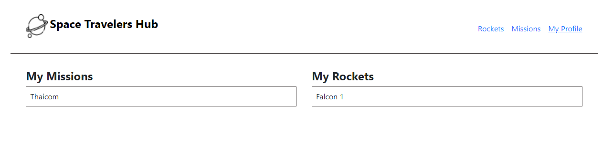

## Preview

Rocket Page

Mission Page

Profile Page

<h1 align="center">Space Travelers Hub</h1>

> A web application for a company that provides commercial and scientific space travel services. This application allows users to book rockets and join selected space missions.

## Live Link 

[Space Travelers](https://space-hub1.netlify.app)

## Built With

- **REACT** and **CSS** and **Javascript**

## Getting Started

To get a local copy up and running follow these setup steps below.

### Setup

- Simply fork this project
- run `npm i `to install all dependencies
- run `npm run build` to bundle the project with webpack, and
- run `npm start` to launch the application
- Open [http://localhost:3000](http://localhost:3000) to view it in your browser.

## Authors

👤 **Omulu Michael**

- GitHub: [@Mikelobi](https://github.com/Mikelobi)
- Twitter: [@Mikelobi](https://twitter.com/@omulum)
- LinkedIn: [@Mikelobi](https://linkedin.com/in/omulu)

👤 **Haji Bamsi**
- GitHub: [@Bamsi](https://github.com/bamsi)
- Twitter: [@Bamsi](https://twitter.com/bamsi)
- LinkedIn: [@bamsi](https://linkedin.com/in/bamsi)

## 🤝 Contributing

Contributions, issues, and feature requests are welcome!

Feel free to check the [issues page](https://github.com/Mikelobi/space-travelers-hub/issues).

## Show your support

Give a ⭐️ if you like this project!

## Acknowledgments

Huge thanks to everyone who helped us in any capacity to complete this project

## 📝 License

This project is [MIT](https://opensource.org/licenses/MIT) licensed.
